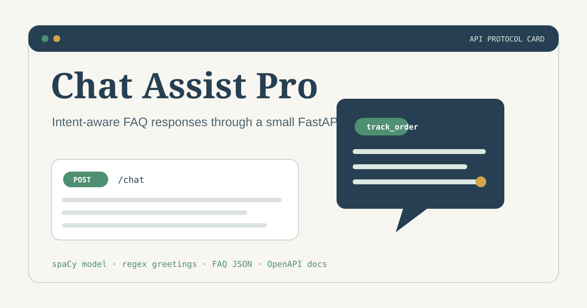
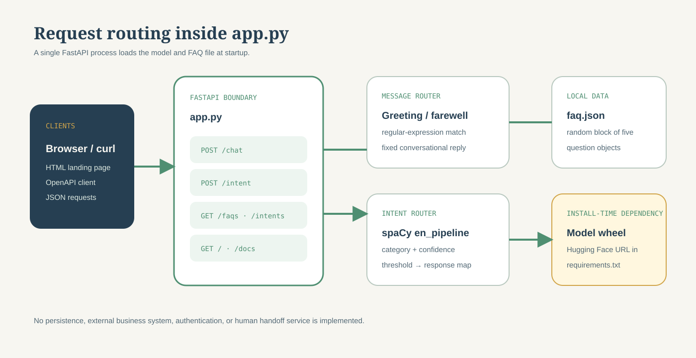

<div align="center">
  

# Chat Assist Pro

**A FastAPI service that classifies support intents and returns deterministic FAQ-style responses.**

[](pyproject.toml)
[](app.py)
[](requirements.txt)

[Interfaces](#interfaces) · [Quick start](#quick-start) · [API](#api-reference) · [Architecture](#architecture) · [Limitations](#scope-and-limitations)

</div>

<div align="center">
  
</div>

## What is it?

Chat Assist Pro is a compact customer-support intent-classification collection. Its primary FastAPI service recognizes greetings and farewells with regular expressions, classifies other messages with a packaged spaCy model, and maps supported intent labels to fixed responses. A separate Streamlit interface includes a bundled historical model artifact, chat history, and FAQ buttons.

Neither interface connects to orders, payments, accounts, tickets, or a human-agent system. Responses such as cancellation, refund, or account changes are examples; they do not perform those actions.

## Interfaces

| Path | Surface | Model delivery | Best use |
| --- | --- | --- | --- |
| Repository root | FastAPI + static landing page | Downloads the declared spaCy pipeline during dependency installation | API exploration and integration experiments |
| [`interfaces/streamlit-intent-classifier/`](interfaces/streamlit-intent-classifier/) | Streamlit chat UI | Loads the checked-in 27-intent spaCy artifact | Interactive model demonstration and training-reference review |

The Streamlit interface was consolidated from the former [`customer-support-intent-classification-streamlit`](https://github.com/jayanth-mkv/customer-support-intent-classification-streamlit) repository. Its redundant nested app copy was intentionally omitted; the original repository remains available as the historical record.

## Quick start

The Poetry manifest targets Python 3.10, while the downloadable `en_pipeline` model is declared only in `requirements.txt`. The most complete local setup is therefore:

```bash
python -m venv .venv
source .venv/bin/activate
python -m pip install -r requirements.txt
uvicorn app:app --reload
```

On Windows PowerShell, activate with `.\.venv\Scripts\Activate.ps1`.

Open:

- Landing page: `http://localhost:8000/`
- OpenAPI docs: `http://localhost:8000/docs`

Try the chat endpoint:

```bash
curl -X POST http://localhost:8000/chat \
  -H "Content-Type: application/json" \
  -d '{"message":"How do I track my order?"}'
```

## API reference

| Method | Path | Implemented response |
| --- | --- | --- |
| `GET` | `/` | Static HTML service overview from `index.html` |
| `POST` | `/chat` | Greeting/farewell response or response mapped from the highest-confidence spaCy intent |
| `POST` | `/intent` | Detected intent and confidence |
| `GET` | `/faqs` | A random contiguous block of five FAQ objects from `faq.json` |
| `GET` | `/intents` | The intent keys supported by the response map |
| `GET` | `/docs` | FastAPI-generated Swagger UI |

`POST /chat` and `POST /intent` accept:

```json
{
  "message": "I need help with my invoice"
}
```

The configured confidence threshold is `0.7`. Messages below it receive a request for clarification.

## Architecture



## Docker

```bash
docker build -t chat-assist-pro .
docker run --rm -p 7860:7860 chat-assist-pro
```

The container command listens on port `7860`. The Dockerfile’s `EXPOSE 8000` line does not match that command, so publish port `7860` as shown.

The Docker image uses Python 3.9 even though `pyproject.toml` targets Python 3.10. The pip requirements are unpinned except for the model wheel; rebuilds can therefore resolve different dependency versions.

## Scope and limitations

- Responses are static templates and placeholders, not transactions against real systems.
- The intent model is downloaded from a Hugging Face wheel URL during installation and loaded at process startup.
- FAQ selection assumes at least five entries and returns objects, despite older docstrings describing strings.
- There is no authentication, rate limiting, persistence, observability, feedback capture, or escalation workflow.
- The source includes example phone numbers, emails, invoice links, and deployed URLs; replace them before deployment.
- The Streamlit model artifact is roughly 30 MB, and its recorded evaluation cannot be reproduced without the external Kaggle dataset.
- No automated tests, CI configuration, health endpoint, or root license file is committed.

## Repository layout

```text
chat-assist-pro/
├── app.py            # FastAPI service and intent routing
├── faq.json          # local FAQ questions
├── interfaces/       # independent user-interface experiments
│   └── streamlit-intent-classifier/
├── index.html        # landing page
├── requirements.txt  # runtime packages + spaCy model wheel
├── pyproject.toml    # Poetry metadata
└── Dockerfile
```
