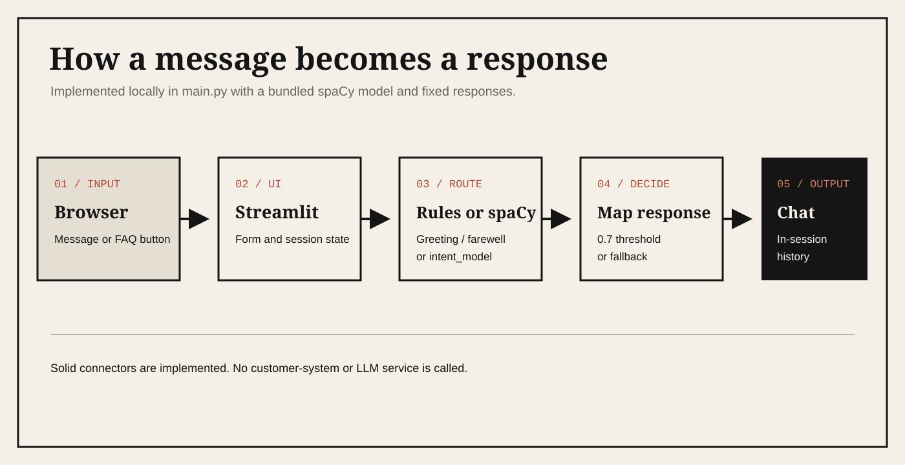

  
  <h1>Chat Assist Pro — Streamlit Intent Classifier</h1>
  
<strong>Route customer-support questions through a bundled spaCy model in a local Streamlit chat interface.</strong>

  
A self-contained demonstration with fixed responses—not a connected customer-service system.

  
  
  

  [Demo](#demo) · [What is it?](#what-is-it) · [Run locally](#run-locally) · [Model evidence](#model-evidence) · [Architecture](#architecture) · [Limitations](#limitations)

## Demo

  

  <a href="https://customer-support-chatbotapp-intent-classification.streamlit.app/">Open the live Streamlit app</a>
  ·
  <a href="https://www.youtube.com/watch?v=sImf3MkfvfM">Watch the full walkthrough</a>

## What is it?

This interface is for people experimenting with intent classification and lightweight support-chat experiences. A Streamlit app accepts a message, handles greetings and farewells with regular expressions, and otherwise asks the bundled spaCy text-classification model to choose one of 27 support intents.

Everything runs locally after dependencies are installed. The response for each intent is fixed in [main.py](main.py); the demo does not call an LLM, order system, payment service, account database, or human-support platform.

| Capability | Status | Evidence |
| --- | --- | --- |
| Intent routing | Implemented | Bundled [intent_model/](intent_model/) loaded by spaCy with a <code>0.7</code> confidence threshold. |
| Chat and FAQ interface | Implemented | Streamlit form, five FAQ buttons, progress state, and in-session chat history. |
| Customer-service actions | Simulated | Messages such as cancellation, refund, or address updates are static text only. |
| Training experiment | Recorded | The notebook contains training and evaluation output; its Kaggle datasets are not included. |

## Run locally

Use Python 3.10; the checked-in Poetry metadata constrains the project to that minor version.

~~~bash
git clone https://github.com/jayanth-mkv/chat-assist-pro.git
cd chat-assist-pro/interfaces/streamlit-intent-classifier
python -m venv .venv
~~~

Activate the environment, then install and start the app:

~~~bash
python -m pip install -r requirements.txt
streamlit run main.py
~~~

Open <http://localhost:8501>. The model and FAQ prompts are already included; no API key is required.

### Docker

The included Dockerfile runs the same <code>main.py</code> entry point:

~~~bash
docker build -t customer-support-intent-demo .
docker run --rm -p 8501:8501 customer-support-intent-demo
~~~

## How it responds

- Greetings and farewells bypass the model and return fixed conversational messages.
- Other messages are classified by the spaCy model in [intent_model/](intent_model/).
- Predictions at or above <code>0.7</code> map to a predefined response in [main.py](main.py).
- Lower-confidence predictions return a request to rephrase.
- Chat history exists only in Streamlit session state and is not persisted.

## Model evidence

The checked-in [intent-classify.ipynb](intent-classify.ipynb) records a test accuracy of <code>0.991442542787286</code> after 50 training epochs. That number describes the notebook's run against the Bitext Kaggle testing CSV; it is not an independently reproduced benchmark for the deployed app.

The repository does not contain those training/testing CSVs or a standalone <code>train_model.py</code>, so the result cannot be reproduced from this clone alone. The relationship between the notebook output and the exact bundled <code>intent_model/</code> artifact is not versioned.

## Architecture

  

## Repository map

| Path | Purpose |
| --- | --- |
| [main.py](main.py) | Streamlit interface, routing rules, confidence threshold, and fixed responses. |
| [intent_model/](intent_model/) | Bundled spaCy text-classification pipeline. |
| [faq.json](faq.json) | Example questions shown as buttons. |
| [intent-classify.ipynb](intent-classify.ipynb) | Kaggle-oriented training and evaluation experiment. |
| [Dockerfile](Dockerfile) | Python 3.10 container for the Streamlit app. |

## Consolidation status

This interface is maintained inside [`chat-assist-pro`](https://github.com/jayanth-mkv/chat-assist-pro). It was consolidated from [`customer-support-intent-classification-streamlit`](https://github.com/jayanth-mkv/customer-support-intent-classification-streamlit), which preserves the original standalone history. A redundant nested copy of the application was not carried into the canonical collection.

## Limitations

- All business actions are simulated text; no order, refund, invoice, account, or agent handoff is executed.
- Accuracy evidence is notebook output only and is not reproducible without the external Kaggle dataset.
- The app interpolates user text into HTML rendered with <code>unsafe_allow_html=True</code>; escape or sanitize input before exposing a derivative app to untrusted users.
- The model supports only its fixed intent labels and English patterns; ambiguous or out-of-domain wording may produce confident but incorrect routing.
- There are no automated application or model-regression tests.
- No repository-level license file is included, so reuse terms are not currently stated.
